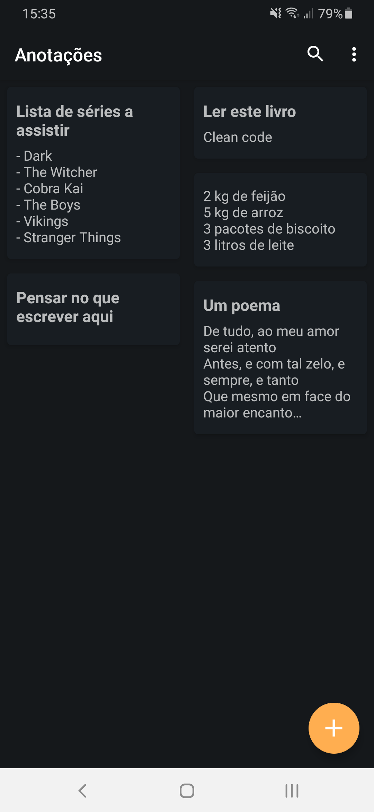
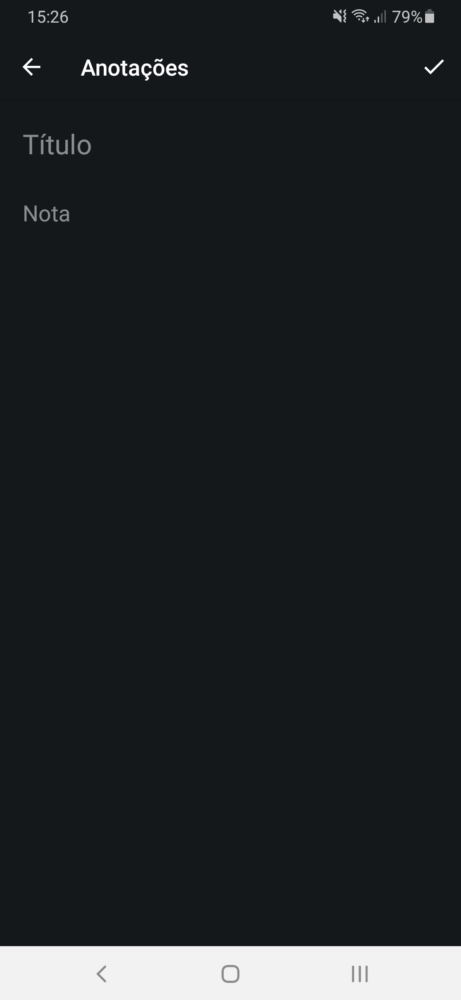
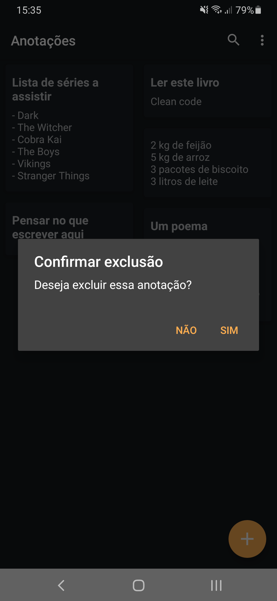
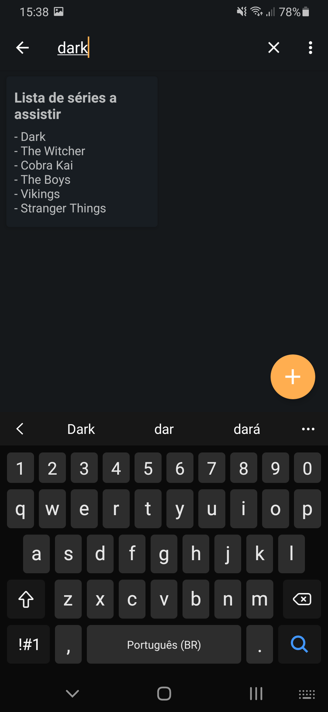

# App de Anotações no Android
Criei este aplicativo como forma de estudo para operações CRUD utilizando o banco de dados SQLite no Android com Java. Na criação do layout me inspirei no aplicativo de anotações do Google, o Google Keep, de forma simples para focar mais nas operações CRUD, mas, sem deixar o aplicativo com um visual desinteressante.

## Visualização
        
